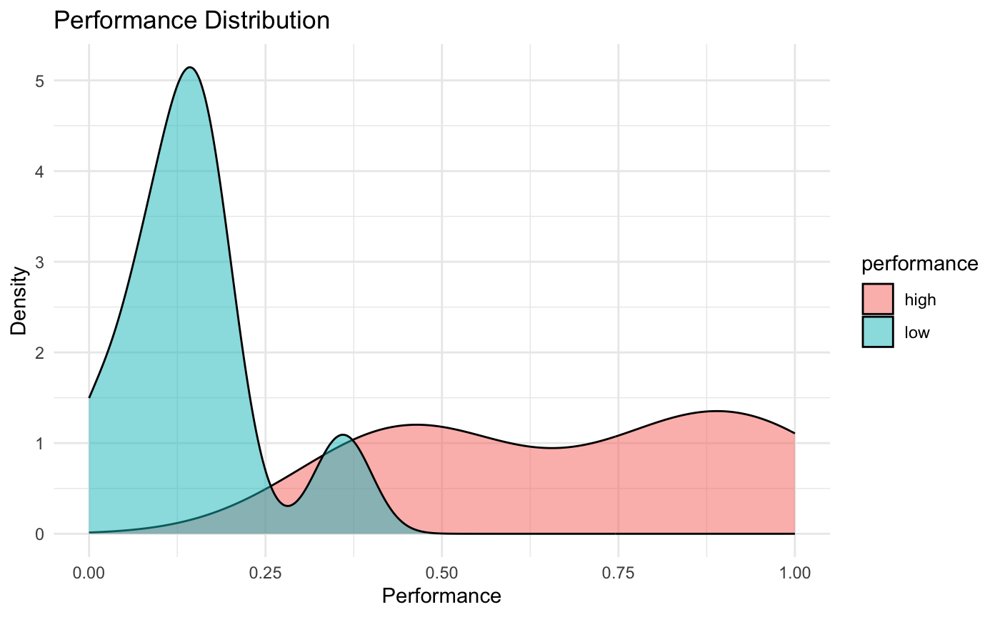
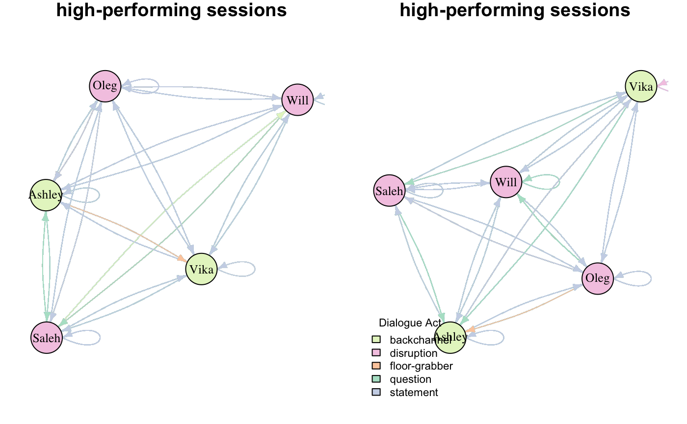
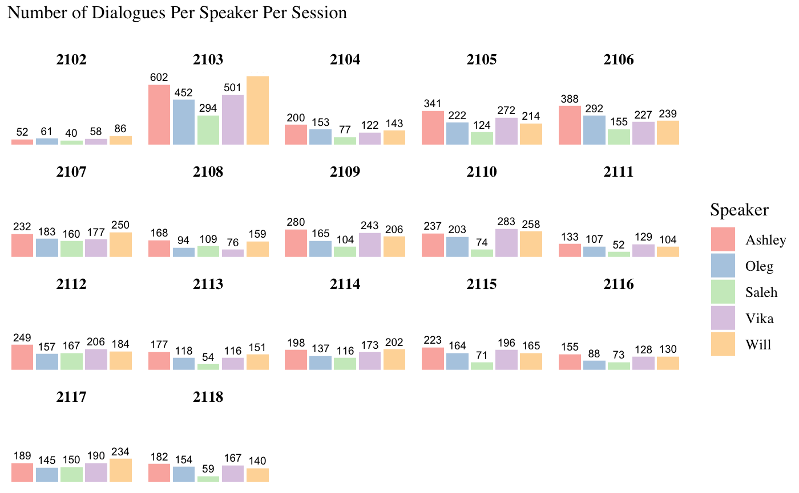
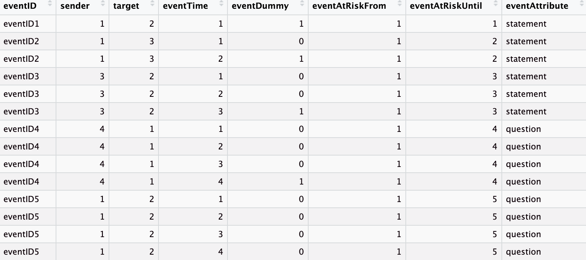
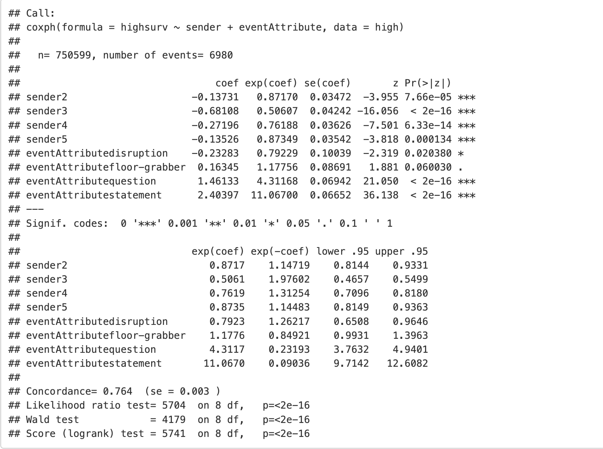
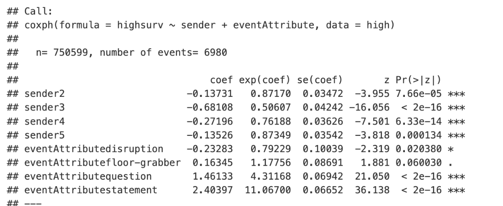
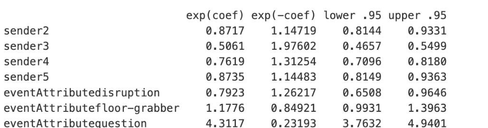
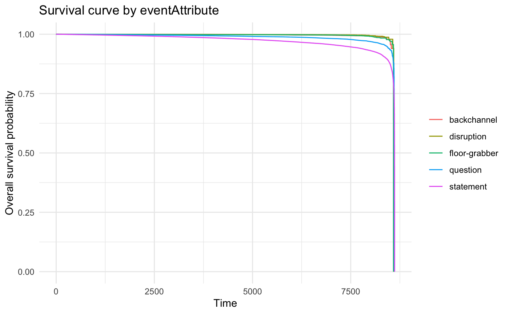
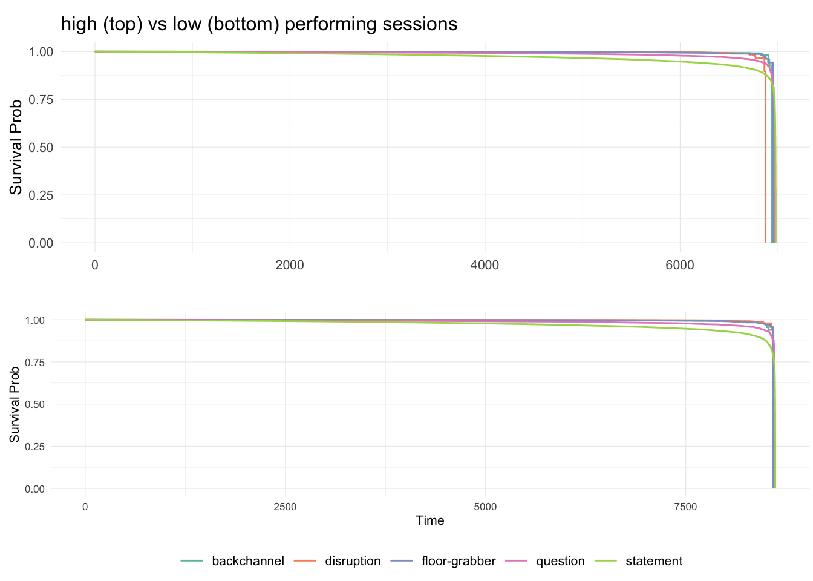

## Project Directory

#### R Code

-   data_clean.Rmd: initial data cleaning
-   data_process.Rmd: specifically prepare the data for REM modeling
    (sender, receiver, time, etc.)
-   data_viz.Rmd
-   REM_model.Rmd

#### Data Directory

1.  trans.csv (transcript data)
2.  preds.csv (predicted label)
3.  perfs.csv
4.  nek21.xlsx (Synthesized from the initial 3)
5.  speaker table
6.  interaction table (for high and low and combined)
7.  REM datasets for high & low
8.  `surv_object` for high & low
9.  `Model_result.Rmd:`model output for high & low and visualization

### Setup

The following R packages are necessary to run the REM analysis:

```{r, message=FALSE, warning=FALSE}
if (!require("igraph")) install.packages("igraph")
if (!require("rem")) install.packages("rem")
if (!require("network")) install.packages("network")
if (!require("tidyr")) install.packages("tidyr")
if (!require("caret")) install.packages("caret")
if (!require("survival")) install.packages("survival")
if (!require("dplyr")) install.packages("dplyr")
if (!require("ggplot2")) install.packages("ggplot2")
if (!require("ggraph")) install.packages("ggraph")
if (!require("ggraph")) install.packages("library(ggsurvfit)")
library(knitr)
# do not echo or run code
knitr::opts_chunk$set(echo = FALSE, eval = FALSE)
```

## I. Data Preparation & EDA

### A. Data Cleaning (`data_clean.Rmd)`

RCode: `data_clean.Rmd`

Input file: nek21.xlsx

Output:

1.  filtered_dialog_data.csv (filtered dialogue data based on only main
    speakers)

2.  senders.csv (actor attribute)

Main changes

-   Original Data: 8 Senders ( "Alex" "Ashley" "Igor" "Katya" "Oleg"
    "Saleh" "Vika" "Will")

-   After Filtering: 5 Senders ( "Ashley", "Will", "Saleh", "Oleg",
    "Vika")

Rationale

-   Igor was present only in session 2102

-   Katya was present only in the first three sessions: 2102, 2103, 2104

-   Alex seemed to be out of nowhere

-   Only five 'consistent' senders

### B. Data Preparation for REM Modeling (`data_process.Rmd`)

**Output**

1.  high_perf_interactions.RDS

2.  low_perf_interactions.RDS

3.  high_perf_interactions.csv

4.  low_perf_interactions.csv

**Data processing** deals with three tables

1.  **Interactions Data**:
    -   Contains information about the sender, receiver, time of
        interaction, and type of interaction (dialogue act type)
2.  **Actors Data**: Contains attributes of each actor, such as name and
    gender
3.  **Performance Data**
    -   Min 0.0000
    -   Mean 0.4202 0.7149
    -   Max 1.0000

|             |           |
|:-----------:|:---------:|
| performance |   mean    |
|    high     | 0.6965765 |
|     low     | 0.1437967 |

-   High: 2117 2111 2113 2107 2110 2116 2106 2102 2118

-   Low: 2112 2104 2101 2105 2115 2108 2103 2114 2109

{width="336"}

### C. Data Visualization (`data_viz.Rmd`)

see `rem_survival_analysis.Rmd` for visualizations

{width="325"}

{width="322"}

## II. REM Modeling (`REM_model.RmD`)

### A. Creating REM Dataset

#### Files/Data Output

1.  `REM.data.high.RData`

2.  `REM.data.low.RData`

#### Overview

-   <div>

    {width="622"}

    </div>

Before fitting a relational event model, data must be prepared in a
specific format:

-   **EVENTID: Timestamp:** Each interaction event should be
    time-stamped (in this case 1, 2, 3...)
-   **Speaker Sequence:** The sequence of speakers or actors involved in
    each event (same as the timestamp in this case)
-   **Performance:** An indicator of the performance level (e.g., high
    or low) associated with the event (which is how we divided the
    dataset)
-   **Dialogue Act Classification:** Each interaction should be
    classified according to its dialogue act type (e.g., statement,
    question, backchannel).

### B. Methodology

### Incremental Model Building

#### Files/Data Output

1.  `surv_object_high.RData`

2.  `surv_object_low.RData`

#### Overview

Incremental model building involves fitting several models to understand
the effect of different factors on interaction events:

-   **Model 0**: Baseline hazard function.
-   **Model 1**: Effect of sender attributes.
-   **Model 2**: Effect of receiver attributes.
-   **Model 3**: Combined sender and receiver effects.
-   **Model 4**: Effect of dialogue act types.
-   **Model 5**: Combined sender and dialogue act effects.

### C. Comparative Analysis & Result

#### Files/Data Output

1.  `data/high_output.RData`

2.  `data/low_output.RData`

3.  `Model_result.Rmd`

#### Useful statistics

-   <div>

    {width="620"}

    </div>

-   Overall model fitness (Concordance, AIC, or BIC)

    -   Concordance

    -   Likelihood ratio test

    -   Wald test = 4179

    -   Score (logrank)

        {width="363"}

-   Independent Variables

    {width="487"}

    -   `coef (sign & strength)`

    -   `P-value` (statistical sinificance)

    -   `exp(coef)`

-   Hazard ratio

    -   HR \> 1: Increases the likelihood of the event. For example, a
        high hazard ratio for questions indicates that asking questions
        significantly drives subsequent interactions.

    -   HR \< 1: Decreases the likelihood of the event.

    -   HR = 1: No effect on the event likelihood

        {width="505"}

### D. Result (Survival) Visualization

<div>

{width="504"}

{width="501"}

</div>

## TBD

-   **Incorporate Degree Centrality:** To understand the influence of
    key members in triggering interactions.
-   **Predict Session Performance:** Using features like participant
    gender, type and sequence of dialogues, and interaction frequency.
-   **Tune Classification Models:** For better accuracy in classifying
    sessions as high or low performing.
