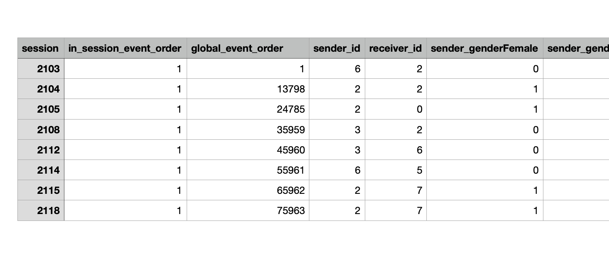

---
output:
pdf_document: default
html_document: default
---

```{r, message = FALSE, include = FALSE}
# Last Updated: 02/12
rm(list = ls())

# Load libraries
library(rstudioapi)
library(tidyverse)
library(tidyr)
library(ggplot2)
library(dplyr)
library(dplyr)
library(caret)
library(RColorBrewer)
library(dplyr)
library(igraph)
library(readxl)
library(igraph)
library(glmnet)
library(remsonic)
library(skimr)
library(dplyr)
library(relevent)
# Set Path
setwd("~/RProjects/SNA_REM/REM_new/")
```

# First Sheet: Sheet1_Dialogues

```{r}
# read excel
dialog_data <- read_excel("data/nek21.xlsx", sheet = "Sheet1_Dialogs") %>% select(-receiver_dialog)
head(dialog_data)
# delete the rows where sender_gender is not Female or Male
unique(dialog_data$receiver_gender)
dialog_data <- dialog_data[dialog_data$receiver_gender == "Unspecified",]
dialog_data <- dialog_data[!dialog_data$sender_gender == "Unspecified",]
dialog_data
```

sAll Igor Ashley Will Katya Saleh Oleg Vika Alex 0 1 2 3 4 5 6 7 8

```{r}
people_list <- unique(dialog_data$sender)
people_list <- people_list[people_list != "All"]
lookup_table <- setNames(seq_along(people_list), people_list)
lookup_table <- c(All = 0, lookup_table)
print(lookup_table)
```

```{r}
dialog_data[, 'sender_id'] <- lookup_table[dialog_data$sender]
dialog_data[, 'receiver_id'] <- lookup_table[dialog_data$receiver]
head(dialog_data)
# renmove whenever dialogue act is a decision_point
dialog_data <- dialog_data %>% filter(sender_dialog != "decision_point")
```

```{r}
head(dialog_data)
```

```{r}
perf_data <- read_excel("data/nek21.xlsx", sheet = "Sheet2_Perfs")
head(perf_data)
```

```{r}
# find all sessionsi of where perf_level is low, high, fail respectively
low_perf <- perf_data %>% filter(perf_level == "low")
high_perf <- perf_data %>% filter(perf_level == "high")
fail_perf <- perf_data %>% filter(perf_level == "failed")
print(paste("Number of low performance sessions: ", nrow(low_perf), list(low_perf$session)))
print(paste("Number of high performance sessions: ", nrow(high_perf), list(high_perf$session)))
print(paste("Number of fail performance sessions: ", nrow(fail_perf), list(fail_perf$session)))
```

```{r}
high_perf_sessions <- c(2114, 2103, 2108, 2115, 2105, 2104, 2112, 2118)
low_perf_sessions <-c(2102, 2106, 2116, 2110, 2107, 2113, 2111, 2117)


high_perf_all <- dialog_data %>% filter(session %in% high_perf_sessions)
low_perf_all <- dialog_data %>% filter(session %in% low_perf_sessions)

high_perf_all <- high_perf_all %>%
  group_by(session) %>% 
  mutate(in_session_event_order= row_number())%>%
  ungroup() %>%
  arrange(session, in_session_event_order)


low_perf_all <- low_perf_all %>%
  group_by(session) %>% 
  mutate(in_session_event_order = row_number())%>%
  ungroup() %>%
  arrange(session, in_session_event_order)

```

```{r}
F
levels(high_perf_all$sender_gender) <- list(male="M", female="F")
levels(low_perf_all$receiver_gender) <- list(male="M", female="F")
levels(low_perf_all$sender_dialog) <- list(as.factor(unique(low_perf_all$sender_dialog)))

dmy_high <- dummyVars(~ sender_gender + receiver_gender + sender_dialog, sep = "_", data = high_perf_all, levelsOnly = FALSE)

trsf_high <- data.frame(predict(dmy_high, newdata = high_perf_all))
head(trsf_high)
high_perf_final <- cbind(high_perf_all, trsf_high)

high_perf_final %>% select(-c(sender, receiver, sender_dialog, sender_gender, receiver_gender, sender_dialog)) %>% select(session, in_session_event_order, everything()) -> high_perf_final

dmy_low <- dummyVars(~ sender_gender + receiver_gender + sender_dialog, sep = ".", data = low_perf_all, levelsOnly = FALSE)
trsf_low <- data.frame(predict(dmy_low, newdata = low_perf_all))
head(trsf_low)
low_perf_final <- cbind(low_perf_all, trsf_low)

low_perf_final %>% select(-c(sender, receiver, sender_dialog, sender_gender, receiver_gender, sender_dialog)) %>% select(session, in_session_event_order, everything()) -> low_perf_final
```

```{r}
write_csv(high_perf_final, "data/high_perf_final.csv")
write_csv(low_perf_final, "data/low_perf_final.csv")
```

```{r}
saveRDS(high_perf_final, "data/high_perf_final.RData")
saveRDS(low_perf_final, "data/low_perf_final.RData")
```

-   **High Performing Sessions: [2114, 2103, 2108, 2115, 2105, 2104, 2112, 2118]{style="color: blue;"}**

-   **Low Performing Sessions: [2102, 2106, 2116, 2110, 2107, 2113, 2111, 2117]{style="color: green;"}**

-   Can ignore the Failed Session


